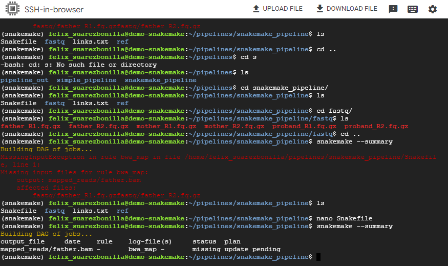

# 🧪 Bioinformatics Pipeline Overview

This example a bioinformatics pipeline depicts a series of orchestrated data processing steps where each step builds on the previous one. These pipelines are crucial in dealing with the influx of large biological data, particularly in genomics, proteomics, or complex interactions with them. They offer reproducibility, organization, and automation, enabling the processing of large-scale biological data and achieving reproducible results.

<div align=center>
    <a href="#snakemake_pipeline"> 🐍 Snakemake Pipeline  | </a>
    <a href="#project_structure"> 📂 Project Structure | </a>
    <a href="#snakemake_workflow"> 🎯 Workflow | </a>
    <a href="#installation"> 🚀 Installation | </a>
    <a href="#usage"> 🛠️ Usage | </a>
    
</div>

<hr/>

### ✏️ Steps in a Typical Bioinformatics Pipeline:

1. **Data Collection**: Collect raw data from genomic sequencing, usually from a sequencing machine, which consists of short DNA sequences called reads.
2. **Data Preprocessing**: Process raw data to ensure the quality of reads, correct or remove low-quality reads, and prepare them for downstream analysis such as read mapping.
3. **Data Analysis**: Perform the main analysis tasks such as variant calling, identifying genetic variations within the sequenced genomes.
4. **Interpretation and Visualization**: Interpret the results of the analysis, annotate variants to provide information about their potential effects, and visualize the results using plots or tables.

### Building Bioinformatics Pipelines

There are several ways to build bioinformatics pipelines:

1. **Scripting Languages**: Use scripting languages like Python or Bash to write a series of scripts that perform each step of the pipeline.
2. **Workflow Management Systems**: Utilize workflow management systems such as `Snakemake` to define a series of rules that describe how to create the final output from the input data.
3. **Automated GUI**: Use automated graphical user interfaces like Galaxy to construct pipelines by connecting predefined tools and workflows.

<div id="snakemake_pipeline"></div>

## 🐍 Snakemake Pipeline for DNA Sequence Mapping

This Snakemake pipeline automates DNA sequence mapping using the BWA aligner, facilitating the alignment of sequencing reads to the human reference genome (`hg19_chr8.fa`) for multiple samples (`father, mother, and proband`). The pipeline uses the parallel processing for efficient handling of large-scale sequencing data.

<div id="project_structure"></div>

## 📂Project Structure

The project directory is organized as follows:

```
📂snakemake_pipeline/
├── 📂fastq/
│   ├── father_R1.fq.gz
│   ├── father_R2.fq.gz
│   ├── mother_R1.fq.gz
│   ├── mother_R2.fq.gz
│   ├── proband_R1.fq.gz
│   └── proband_R2.fq.gz
├── 📂ref/
│   └── hg19_chr8.fa
├── links.txt
├── 📂mapped_reads/
├── 🐍Snakefile
├── 🐍Snakefile2
└── 🐍Snakefile3
```

- **links.txt:** A file containing links to FASTQ files containing DNA sequencing reads and the genome reference.
- **📂ref/:** Directory containing the reference genome file (`hg19_chr8.fa`).
- **📂fastq/:** Directory containing the raw FASTQ files for sequencing data.
- **📂mapped_reads/:** Directory for storing the mapped sequencing reads in BAM format.
- **🐍Snakefile, Snakefile2, Snakefile3:** Snakemake workflow files for different stages of the pipeline.

<div id="snakemake_workflow"></div>

### Snakemake Workflow Explanation

#### 🐍 Snakefile

The `Snakefile` defines a rule named `bwa_map` that maps sequencing reads from the father's FASTQ files to the reference genome using BWA. The output is stored as `mapped_reads/father.bam`. It utilizes fixed file paths for the reference genome and father's FASTQ files.

#### 🐍 Snakefile2

Similarly, `Snakefile2` defines a rule named `bwa_map` to map sequencing reads from any sample's FASTQ files (specified by {sample}) to the reference genome. The output is stored as `mapped_reads/{sample}.bam`. This rule allows for mapping multiple samples in a flexible manner.

Additionally, there's a cleanup rule to remove all BAM files from the `mapped_reads/` directory after completion.

#### 🐍 Snakefile3

`Snakefile3` defines a list of samples [father, mother, proband]. The rule `all` ensures that all samples are processed, and the `bwa_map` rule is applied to each sample's FASTQ files. Similar to `Snakefile2`, it also includes a cleanup rule.

### 📝 Interpreting Results

After executing the Snakemake workflow, the mapped sequencing reads will be stored in BAM format in the `mapped_reads/` directory. These BAM files can be further analyzed using tools like Samtools or visualized using genome browsers to interpret the alignment results.

<div id="installation"></div>

## 🚀 Installation

1. Ensure `BWA` and `Samtools` are installed in your environment.

```bash
sudo apt-get install bwa
```

```bash
sudo apt-get install samtools
```

2. [Activate your conda/mamba enviroment](https://snakemake.readthedocs.io/en/stable/getting_started/installation.html).

```bash
conda activate snakemake
```

3.  [Download FASTQ files genome reference](https://training.galaxyproject.org/training-material/topics/variant-analysis/tutorials/exome-seq/tutorial.html#data-preparation).

```bash
# Fetch data using links provided
cat links.txt | xargs -i -P 4 wget '{}'
```

4.  Place the reference genome file (`hg19_chr8.fa`) in the `ref/` directory.
5.  Place the FASTQ files for each sample in the `fastq/` directory.
6.  Customize the Snakefile (`Snakefile`), Snakefile2 (`Snakefile2`), or Snakefile3 (`Snakefile3`) as per your requirements.
7.  Execute Snakemake using the desired Snakefile: `snakemake -s Snakefile`.

<div id="usage"></div>

## 🛠️ Usage

**Pipeline Execution with Snakemake**

Below are the steps involved in executing a pipeline using Snakemake:

1. Index the reference genome using BWA.

```bash
bwa index ref/hg19_chr8.fa
```

This command indexes the reference genome file hg19_chr8.fa using the BWA aligner. Indexing is a necessary step for efficient alignment of sequencing reads.


2. Evidence the snakemake summary

```bash
snakemake --summary
```

This command generates a summary of the Snakemake workflow, showing information such as the number of rules, targets and files to be created.



3. Execute the pipeline using Snakemake.

```bash
snakemake --cores 1 -p
```

This command executes the Snakemake workflow using a single core (--cores 1) and prints the commands that are executed (-p).


4. Monitor and manage pipeline execution.

```bash
samtools flagstat mapped_reads/father.bam
```

This command uses samtools to generate flag statistics for the BAM file father.bam, which likely contains alignment information for sequencing reads from a sample named "father".


**Pipeline Execution with Snakemake2**
